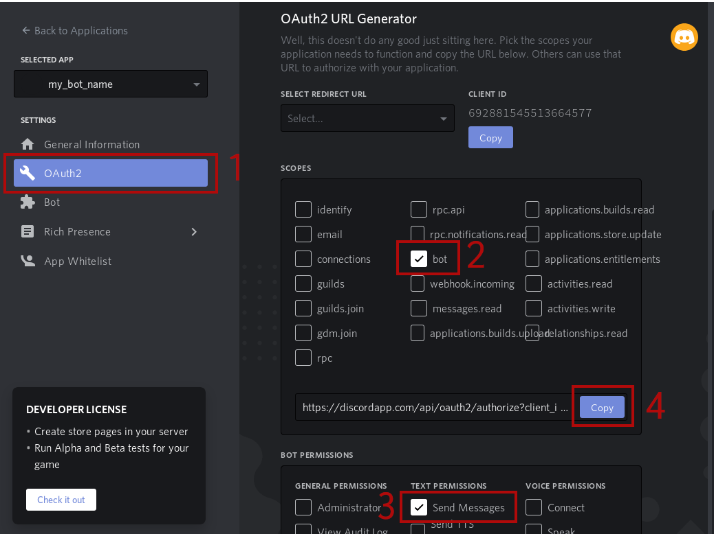
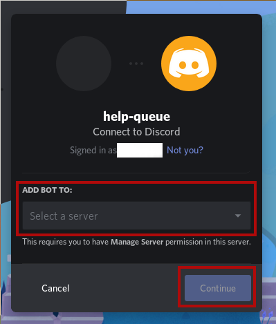

# Discord Bot: Help Queue
A simple (quick and dirty) bot which handles a simple (fifo) queue 
for help / support / private discussion requests.

One or more admin members can dequeue members from the queue 
to offer help / support / private discussion in an orderly fashion.

# Installation 

## Clone the repo
```
git clone https://github.com/jonascj/discordhelp-queue-bot.git
```

or download files in some other manner from the repo.

## Install dependencies 
```
pip install -r reqs.txt
```
or
```
pip install discord.py python-dotenv
```

## Create a Discord application 
Go to <https://discordapp.com/developers/applications>,
login with an discordapp.com user
and follow the steps as indicated in the screenshot below:


## Add a bot to the application


## Bot token
Obtain a bot token and add it to your `.env` file.


## OAuth2 URL
Obtain an OAuth2 URL used to invite your bot to a server / guild.

Follow the steps as indicated in the screenshot below: 


In step 3 you need to select the following permissions: 
* `Send Messages`
* `Move Members` (optional, needed automatically move
members to the same voice channel as the dequeuing admin)

## Invite your bot to your server/guild
1. Visit the copied OAuth2 URL (`https://discordapp.com/api/oauth2/auth...`)
in your browser.

2. Login the user account used to create your guild/server
and select the server you wish to add the bot to.

If you login as a user which has created no servers
and does not have *Manage Server* permission on any other servers
the *Select a server* dropdown menu will be empty.




# Starting the bot


