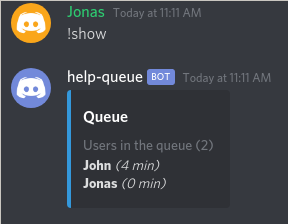
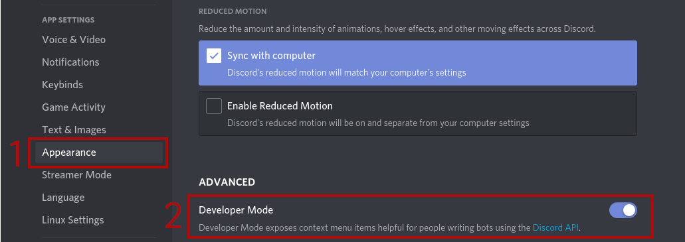
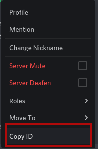

# Discord Bot: Help Queue
A simple (quick and dirty) bot which handles a simple (fifo) queue 
for help / support / private discussion requests.
It uses [discord.py](https://discordpy.readthedocs.io/en/latest/index.html)
to interact with Discord services.



One or more admin members can dequeue members from the queue 
to offer help / support / private discussion in an orderly fashion.

* Members can queue for help by typing `!needhelp`

* Members can leave the queue by typing `!nvm`

* Members can view the queue by typing `!show`

* Admin members can dequeue members (to offer them help) by typing `!next`
  (if both admin and queued member is connected to voice channels
   the bot will move the member to the admin's voice channel)

* Admin members can reset the queue by typing `!qe` (queue empty)

The bot could be run on a machine which is always on 
(a VPS or a Discord bot host service)
and join multiple servers. 
Seperate queues are maintained for each server the bot joins
and users/admins on one server can only interact with the queue of their server.

Personally, however, I use it to join a single server 
and run the bot locally on personal computer
since it is of little when I'm offline.


# Quickstart
1. Clone the repo.

2. Create a copy of `.env.template` for configuration:
```
cp .env.template .env
```

3. Create an application with a bot at
<https://discordapp.com/developers/applications>,

4. Add your bot's token to your `.env` file:
```
DISCORD_TOKEN=<your-token-here>
```

5. Add the user-ids of admin members and name of admin roles 
to your `.env` file. 
These users will have admin access to the queue
(permission to empty it and dequeue members).

```
ADMIN_USER_IDS=<id1>,<id2>
ADMIN_ROLE_NAME=<role1>,<role2>
```

6. Generate an OAuth2 URL and use it to invite the bot to your server.
The bot needs the following permissions:
* `Send Messages`
* `Move Members` (optional, needed automatically move

7. Start the bot `python help_queue_bot.py`


# Installation 

## Clone the repo
```
git clone https://github.com/jonascj/discordhelp-queue-bot.git
```

or download files in some other manner from the repo.

## Install dependencies 
```
pip install -r reqs.txt
```
or
```
pip install discord.py python-dotenv
```
## Create an `.env` file for configuration
Make a copy of `.env.template` called `.env`:
```
cp .env.template .env
```
This is the configuration for the bot

## Create a Discord application 
Go to <https://discordapp.com/developers/applications>,
login with an discordapp.com user
and follow the steps as indicated in the screenshot below:


## Add a bot to the application


## Bot token
Copy the bot token and add it to your `.env` file:
```
DISCORD_TOKEN=<your-token-here>
```


## OAuth2 URL
Obtain an OAuth2 URL used to invite your bot to a server / guild.

Follow the steps as indicated in the screenshot below: 


In step 3 you need to select the following permissions: 
* `Send Messages`
* `Move Members` (optional, needed automatically move
members to the same voice channel as the dequeuing admin)

## Invite your bot to your server/guild
1. Visit the copied OAuth2 URL (`https://discordapp.com/api/oauth2/auth...`)
in your browser.

2. Login the user account used to create your guild/server
and select the server you wish to add the bot to.

If you login as a user which has created no servers
and does not have *Manage Server* permission on any other servers
the *Select a server* dropdown menu will be empty.


## Configuring admins
You could start your bot at this point (`python help_queue_bot.py`)
but no admins would be configured.
Members would be able to join the queue, 
but noone would be able to dequeue them.

### By user-id
1. Enable Developer Mode in the Discord App 
to gain access to the `Copy ID`-feature.



2. Right-click on any user's username or portrait/icon
and select `Copy ID`



3. Add the ID to the `.env` file
```
ADMIN_USER_IDS=<id1>,<id2>
``` 

### By role names
1. Add a role to your server called `queue-admin` or whatever you wish.
2. Assign this role to all users on your server who should be able to
administrate the queue.
3. Add the role name to your `.env` file:
```
ADMIN_ROLE_NAME=<role1>,<role2>
```

## Start the bot
Finally start the Python bot:
```
python help_queue_bot.py
```

You should now see your bot join your server.  
Test it by sending a message `!help` or `!needhelp`.

The bot is only connected to the server as long as
this Python process is running.
To have a permanent persence on your discord server
the bot should be run on a machine which is always on.


