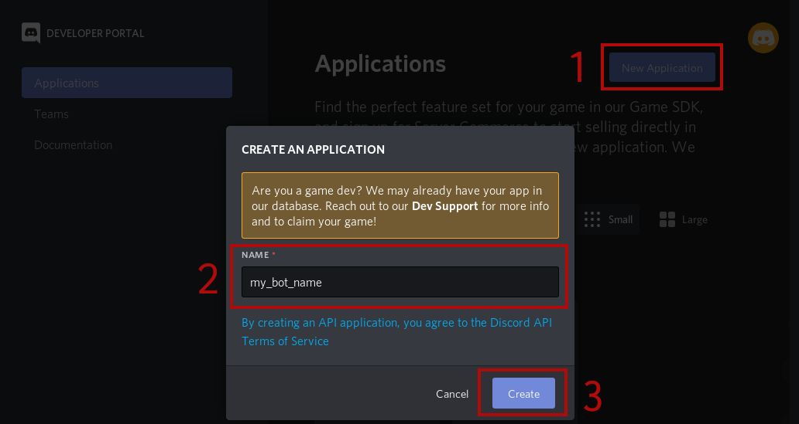

# Discord Bot: Help Queue
A simple bot which handles a simple (fifo) queue 
for help / support / private discussion requests.

One or more admin members can dequeue members from the queue 
to offer help / support / private discussion in an orderly fashion.

# Installation 
See [Create a bot](#create-a-bot)

# Create a bot

https://discordapp.com/developers/applications
